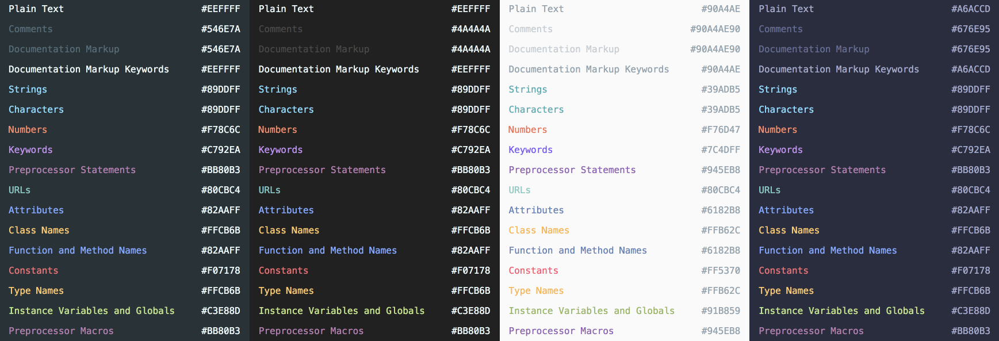

# xcode-material-theme

> A Material Theme for Xcode inspired by [vsc-material-theme](https://github.com/equinusocio/vsc-material-theme).

## Installation

Copy the .xccolortheme file into the following directory:

`~/Library/Developer/Xcode/UserData/FontAndColorThemes`

* Restart Xcode
* Go to preferences and select the theme

## Color Palette

## Screenshot

* Default

* Darker

* Lighter

* Palenight

## License

[MIT](./LICENSE) © [PleaseDont](https://github.com/PleaseDont)
