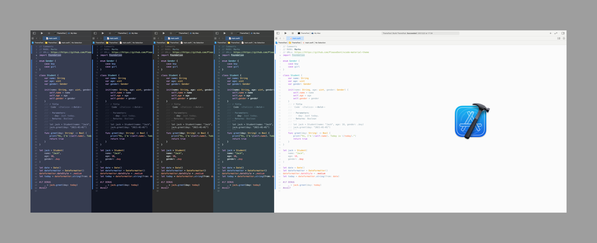

# xcode-material-theme

> A Material Theme for Xcode inspired by [vsc-material-theme](https://github.com/equinusocio/vsc-material-theme).

## Installation

Copy the `*.xccolortheme` file into the following directory:

`~/Library/Developer/Xcode/UserData/FontAndColorThemes`

* Restart Xcode.
* Go to preferences and select the theme.

## Official Portings

- [Windows Terminal](https://github.com/julianlatest/material-windows-terminal) (by [@julianlatest](https://github.com/julianlatest))
- [Vim and NeoVim](https://github.com/kaicataldo/material.vim) (by [@kaicataldo](https://github.com/kaicataldo))
- [Vim](https://github.com/hzchirs/vim-material) (thanks to [@hzchirs](https://github.com/hzchirs)).
- [Terminal OSX](https://gist.github.com/mvaneijgen/4c56701215847dd5ddcf) (thanks to [@mvaneijgen](https://github.com/mvaneijgen)).
- [iTerm2](https://gist.github.com/Revod/3f3115f8d4b90fc986fd4b61441c2567) (by [@Revod](https://github.com/Revod)) and [iTerm2 Palenight](https://github.com/JonathanSpeek/palenight-iterm2) (by [@jonathanspeek](https://github.com/jonathanspeek)).
- [Hyper](https://github.com/equinusocio/hyper-material-theme).
- [ConEmu](https://gist.github.com/rajadain/b306b2ba71bd58a1df41) (thanks to [@rajadain](https://github.com/rajadain)).
- [Slack App](https://slack.com/) ( #263238,#2e3a40,#80CBC4,#FFFFFF,#13191C,#ffffff,#50fa7b,#FF5555 )
- [Nylas N1](https://github.com/jackiehluo/n1-material) (thanks to [@jackiehluo](https://github.com/jackiehluo))
- [Base16](https://github.com/ntpeters/base16-materialtheme-scheme) (by [@ntpeters](https://github.com/ntpeters))
- [Bear Notes](https://github.com/r3volution11/material-theme-bear-notes) (by [@r3volution11](https://github.com/r3volution11))
- [Mattermost](https://gist.github.com/k1r8r0wn/47cfa776a6fa4e9bf3fa40df0fb76c2c) (by [@k1r8r0wn](https://github.com/k1r8r0wn))
- [Material Theme to GitHub](https://github.com/CharlieEtienne/material-github)

## License

[MIT](./LICENSE) © [PleaseDont](https://github.com/PleaseDont)
